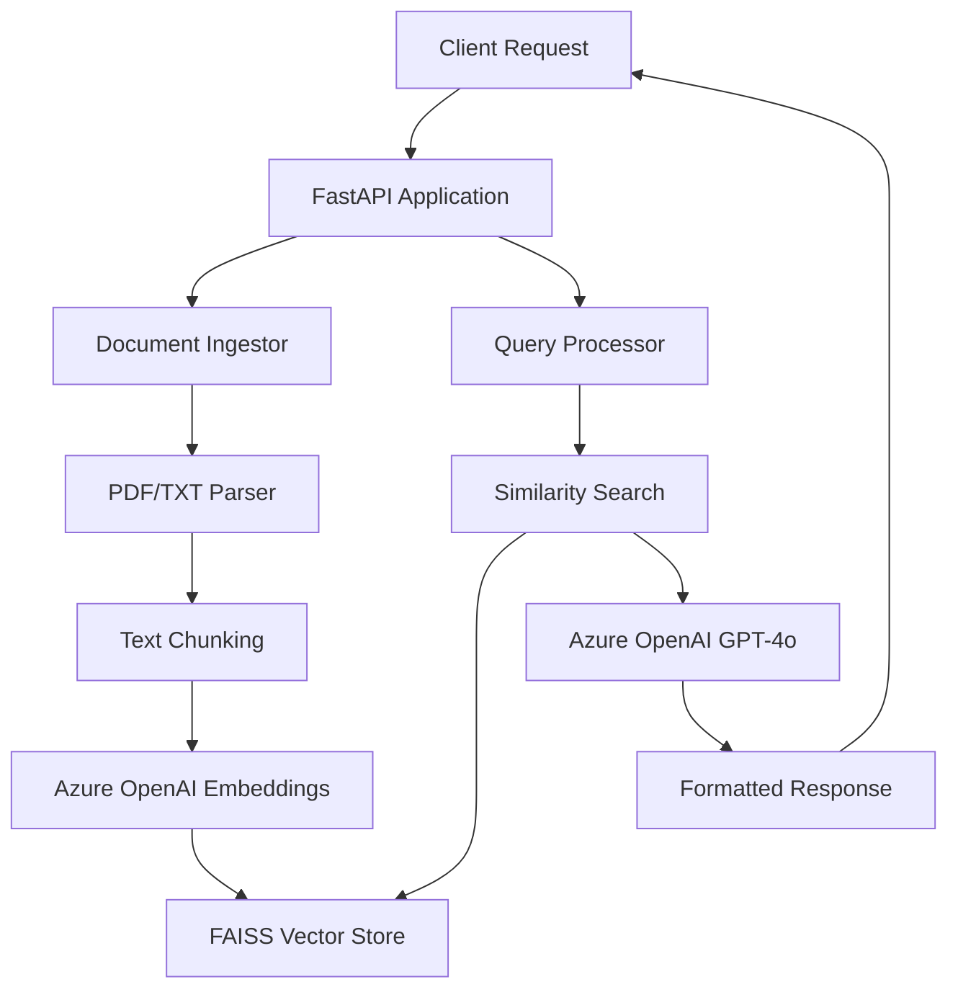
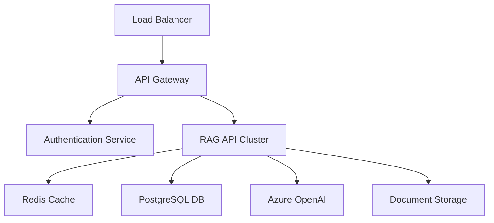

# RAG Application API - Complete Guide

## Table of Contents
1. [Overview](#overview)
2. [Architecture & Flow](#architecture--flow)
3. [Development Journey](#development-journey)
4. [Deployment Process](#deployment-process)
5. [API Usage Guide](#api-usage-guide)
6. [Examples](#examples)
7. [Troubleshooting](#troubleshooting)
8. [Future Enhancements](#future-enhancements)

## Overview

This RAG (Retrieval-Augmented Generation) Application API is a production-ready REST service that enables intelligent document querying using Azure OpenAI. The API allows users to ingest documents (PDF/TXT), create semantic embeddings, and ask natural language questions about the content.

### Key Features
- **Document Ingestion**: Support for PDF and TXT files
- **Semantic Search**: FAISS-based vector similarity search
- **Intelligent Responses**: Azure OpenAI GPT-4o powered answers
- **REST API**: FastAPI-based endpoints with automatic documentation
- **Azure Deployment**: Containerized deployment on Azure Container Instances
- **Real-time Processing**: Upload and query documents instantly

### Technology Stack
- **Backend**: Python 3.9, FastAPI, Uvicorn
- **AI/ML**: Azure OpenAI (GPT-4o, text-embedding-3-large), FAISS, LangChain
- **Document Processing**: PyPDF2, NLTK
- **Containerization**: Docker
- **Cloud Platform**: Microsoft Azure (ACR, ACI)

## Architecture & Flow

### System Architecture



### Data Flow

1. **Document Ingestion Flow**:
   ```
   Upload File → Parse Content → Chunk Text → Generate Embeddings → Store in FAISS Index
   ```

2. **Query Processing Flow**:
   ```
   User Question → Generate Query Embedding → Search Similar Chunks → 
   Retrieve Context → Generate Answer with GPT-4o → Return Response
   ```

### Component Details

#### 1. Document Ingestor (`ingest.py`)
- **Purpose**: Handles document parsing and embedding generation
- **Functions**:
  - `ingest_pdf()`: Extracts text from PDF files page by page
  - `ingest_txt()`: Processes plain text files with chunking
  - `ingest_folder()`: Batch processes entire directories
  - `build_index()`: Creates FAISS vector index from embeddings

#### 2. RAG Query Engine (`rag.py`)
- **Purpose**: Processes user queries and generates responses
- **Functions**:
  - `answer_question()`: Main query processing pipeline
  - `generate_grounded_answer()`: Creates contextual responses using GPT-4o

#### 3. FastAPI Application (`app.py`)
- **Purpose**: REST API endpoints and request handling
- **Key Features**:
  - Async request handling
  - Global ingestor state management
  - CORS support for web applications
  - Automatic API documentation

#### 4. Utilities (`utils.py`)
- **Purpose**: Text processing utilities
- **Functions**:
  - `chunk_text_sentence_based()`: Intelligent text chunking with overlap

## Development Journey

### Phase 1: Initial Analysis
The project started as a command-line RAG application with basic functionality:
- Simple PDF ingestion
- Basic query processing
- Local file storage

### Phase 2: API Conversion
**Transformation Process**:
1. **Architecture Redesign**: Converted from CLI to REST API using FastAPI
2. **State Management**: Implemented global ingestor for persistent document storage
3. **Endpoint Design**: Created RESTful endpoints for all operations
4. **Error Handling**: Added comprehensive error handling and validation
5. **Documentation**: Integrated automatic API documentation with Swagger UI

**Key Decisions**:
- **FastAPI over Flask**: Chosen for async support and automatic documentation
- **Global State**: Maintained in-memory document index for performance
- **Lifespan Management**: Implemented proper startup/shutdown handling

### Phase 3: Containerization
**Docker Implementation**:
1. **Multi-stage Dockerfile**: Optimized for production deployment
2. **Dependency Management**: Streamlined package installation
3. **Environment Configuration**: Secure environment variable handling
4. **Health Checks**: Built-in health monitoring endpoints

### Phase 4: Azure Deployment
**Cloud Migration Process**:
1. **Container Registry**: Created Azure Container Registry for image storage
2. **Cross-platform Build**: Resolved ARM64/AMD64 architecture compatibility
3. **Environment Security**: Secure credential management in Azure
4. **Network Configuration**: Public endpoint configuration with custom DNS
5. **Monitoring**: Implemented health checks and logging

## Deployment Process

### Step-by-Step Deployment Guide

#### Prerequisites
- Azure CLI installed and configured
- Docker installed locally
- Azure OpenAI service provisioned
- Azure subscription with appropriate permissions

#### 1. Environment Setup
```bash
# Clone the repository
git clone <repository-url>
cd rag_application

# Set up environment variables
cp .env.example .env
# Edit .env with your Azure OpenAI credentials
```

#### 2. Local Development
```bash
# Install dependencies
pip install -r requirements.txt

# Run locally
python src/app.py
# API available at: http://localhost:8000
```

#### 3. Docker Deployment
```bash
# Build Docker image
docker build -t rag-api .

# Run with Docker Compose
docker-compose up -d
```

#### 4. Azure Deployment
```bash
# Login to Azure
az login

# Run deployment script
./deploy-to-azure.sh
```

### Deployment Architecture

The application is deployed using:
- **Azure Container Registry**: For Docker image storage
- **Azure Container Instances**: For serverless container hosting
- **Environment Variables**: For secure configuration management
- **Public IP**: For external API access

### Current Deployment Details
- **Registry**: `ragappregistry1754795481.azurecr.io`
- **Container**: `rag-api-final1754797320`
- **URL**: `http://rag-api-final1754797320.eastus.azurecontainer.io:8000`
- **Region**: East US
- **Resources**: 1 CPU, 2GB RAM

## API Usage Guide

### Base URL
```
http://rag-api-final1754797320.eastus.azurecontainer.io:8000
```

### Authentication
Currently no authentication required (development setup). For production, implement:
- API keys
- OAuth 2.0
- Azure AD integration

### Endpoints Documentation

#### 1. Health & Status Endpoints

##### GET `/`
**Description**: Basic API information
```bash
curl http://rag-api-final1754797320.eastus.azurecontainer.io:8000/
```
**Response**:
```json
{
  "message": "RAG Application API is running",
  "version": "1.0.0"
}
```

##### GET `/health`
**Description**: Health check endpoint for monitoring
```bash
curl http://rag-api-final1754797320.eastus.azurecontainer.io:8000/health
```
**Response**:
```json
{
  "status": "healthy",
  "ingestor_ready": true
}
```

##### GET `/status`
**Description**: Detailed system status
```bash
curl http://rag-api-final1754797320.eastus.azurecontainer.io:8000/status
```
**Response**:
```json
{
  "ingestor_initialized": true,
  "documents_count": 4,
  "index_built": true
}
```

#### 2. Document Ingestion Endpoints

##### POST `/ingest/folder`
**Description**: Process all documents in the knowledge_base folder
```bash
curl -X POST http://rag-api-final1754797320.eastus.azurecontainer.io:8000/ingest/folder
```
**Response**:
```json
{
  "message": "Successfully ingested documents from knowledge base folder",
  "files_processed": 3
}
```

##### POST `/ingest/upload`
**Description**: Upload and process a single document
```bash
curl -X POST http://rag-api-final1754797320.eastus.azurecontainer.io:8000/ingest/upload \
  -F "file=@document.pdf"
```
**Response**:
```json
{
  "message": "Successfully uploaded and ingested document.pdf",
  "files_processed": 1
}
```

**Supported File Types**:
- PDF files (.pdf)
- Text files (.txt)

**File Size Limits**:
- Maximum file size: ~50MB
- Recommended: Under 10MB for optimal processing

#### 3. Query Endpoint

##### POST `/query`
**Description**: Ask questions about ingested documents
```bash
curl -X POST http://rag-api-final1754797320.eastus.azurecontainer.io:8000/query \
  -H "Content-Type: application/json" \
  -d '{
    "question": "What are the main topics discussed?",
    "k": 5
  }'
```

**Request Body**:
```json
{
  "question": "string",  // Required: Your question
  "k": 5                 // Optional: Number of relevant chunks to retrieve (default: 5)
}
```

**Response**:
```json
{
  "answer": "Detailed answer based on document content...",
  "message": "Query processed successfully"
}
```

#### 4. Management Endpoints

##### DELETE `/reset`
**Description**: Reset the ingestor (clear all documents)
```bash
curl -X DELETE http://rag-api-final1754797320.eastus.azurecontainer.io:8000/reset
```
**Response**:
```json
{
  "message": "Ingestor has been reset"
}
```

### Interactive API Documentation
Visit: `http://rag-api-final1754797320.eastus.azurecontainer.io:8000/docs`

This provides a Swagger UI interface for:
- Testing all endpoints
- Viewing request/response schemas
- Understanding parameter requirements

## Examples

### Example 1: Complete Workflow

#### Step 1: Check API Status
```bash
curl http://rag-api-final1754797320.eastus.azurecontainer.io:8000/status
```

#### Step 2: Upload a Document
```bash
# Create a sample document
echo "The quick brown fox jumps over the lazy dog. This is a test document for the RAG API." > sample.txt

# Upload the document
curl -X POST http://rag-api-final1754797320.eastus.azurecontainer.io:8000/ingest/upload \
  -F "file=@sample.txt"
```

#### Step 3: Query the Document
```bash
curl -X POST http://rag-api-final1754797320.eastus.azurecontainer.io:8000/query \
  -H "Content-Type: application/json" \
  -d '{"question": "What does the fox do?", "k": 3}'
```

### Example 2: Business Use Case

#### Insurance Document Analysis
```bash
# Query business documents
curl -X POST http://rag-api-final1754797320.eastus.azurecontainer.io:8000/query \
  -H "Content-Type: application/json" \
  -d '{
    "question": "What are the key decision factors for insurance pricing?",
    "k": 5
  }'
```

#### Response Analysis
The API will:
1. Search through ingested insurance documents
2. Find relevant sections about pricing factors
3. Generate a comprehensive answer using GPT-4o
4. Return structured, readable response in Markdown format

### Example 3: Python Client

```python
import requests
import json

# API configuration
BASE_URL = "http://rag-api-final1754797320.eastus.azurecontainer.io:8000"

class RAGClient:
    def __init__(self, base_url):
        self.base_url = base_url
    
    def health_check(self):
        response = requests.get(f"{self.base_url}/health")
        return response.json()
    
    def upload_document(self, file_path):
        with open(file_path, 'rb') as f:
            files = {'file': f}
            response = requests.post(f"{self.base_url}/ingest/upload", files=files)
        return response.json()
    
    def query_documents(self, question, k=5):
        data = {"question": question, "k": k}
        response = requests.post(
            f"{self.base_url}/query",
            headers={"Content-Type": "application/json"},
            data=json.dumps(data)
        )
        return response.json()

# Usage example
client = RAGClient(BASE_URL)

# Check if API is healthy
print(client.health_check())

# Query documents
result = client.query_documents("What are the main topics discussed?")
print(result['answer'])
```

### Example 4: JavaScript/Node.js Client

```javascript
const axios = require('axios');

class RAGClient {
    constructor(baseUrl) {
        this.baseUrl = baseUrl;
        this.client = axios.create({
            baseURL: baseUrl,
            timeout: 30000,
        });
    }

    async healthCheck() {
        const response = await this.client.get('/health');
        return response.data;
    }

    async uploadDocument(filePath) {
        const FormData = require('form-data');
        const fs = require('fs');
        
        const form = new FormData();
        form.append('file', fs.createReadStream(filePath));
        
        const response = await this.client.post('/ingest/upload', form, {
            headers: form.getHeaders()
        });
        return response.data;
    }

    async queryDocuments(question, k = 5) {
        const response = await this.client.post('/query', {
            question,
            k
        });
        return response.data;
    }
}

// Usage
const client = new RAGClient('http://rag-api-final1754797320.eastus.azurecontainer.io:8000');

async function example() {
    // Check health
    console.log(await client.healthCheck());
    
    // Query documents
    const result = await client.queryDocuments('What are the key points?');
    console.log(result.answer);
}

example().catch(console.error);
```

## Troubleshooting

### Common Issues

#### 1. API Not Responding
**Symptoms**: Connection timeout or refused
**Solutions**:
```bash
# Check container status
az container show --resource-group rag-app-rg --name rag-api-final1754797320

# Check logs
az container logs --resource-group rag-app-rg --name rag-api-final1754797320

# Restart container if needed
az container restart --resource-group rag-app-rg --name rag-api-final1754797320
```

#### 2. Upload Failures
**Symptoms**: 400 Bad Request on file upload
**Common Causes**:
- Unsupported file format
- File too large
- Corrupted file

**Solutions**:
```bash
# Check supported formats
echo "Supported: .pdf, .txt files only"

# Test with small file first
curl -X POST http://rag-api-final1754797320.eastus.azurecontainer.io:8000/ingest/upload \
  -F "file=@small_test.txt"
```

#### 3. Query Returns Empty Results
**Symptoms**: API responds but answer is generic
**Causes**:
- No documents ingested
- Question not related to document content
- Embedding/search issues

**Diagnostics**:
```bash
# Check document count
curl http://rag-api-final1754797320.eastus.azurecontainer.io:8000/status

# Reset and re-ingest if needed
curl -X DELETE http://rag-api-final1754797320.eastus.azurecontainer.io:8000/reset
curl -X POST http://rag-api-final1754797320.eastus.azurecontainer.io:8000/ingest/folder
```

#### 4. Slow Response Times
**Symptoms**: Long wait times for responses
**Causes**:
- Large document processing
- Azure OpenAI rate limits
- Network latency

**Optimizations**:
- Reduce `k` parameter in queries
- Process smaller documents
- Consider caching for repeated queries

### Error Codes

| Code | Description | Solution |
|------|-------------|----------|
| 400 | Bad Request | Check request format and parameters |
| 404 | Not Found | Verify endpoint URL |
| 500 | Internal Server Error | Check logs, may be Azure OpenAI issue |
| 503 | Service Unavailable | Container may be restarting |

### Monitoring and Logging

#### Health Monitoring
```bash
# Set up monitoring script
#!/bin/bash
while true; do
    response=$(curl -s -o /dev/null -w "%{http_code}" http://rag-api-final1754797320.eastus.azurecontainer.io:8000/health)
    if [ $response -eq 200 ]; then
        echo "$(date): API is healthy"
    else
        echo "$(date): API is unhealthy (HTTP $response)"
    fi
    sleep 60
done
```

#### Log Analysis
```bash
# Get recent logs
az container logs --resource-group rag-app-rg --name rag-api-final1754797320 --tail 50

# Follow live logs
az container logs --resource-group rag-app-rg --name rag-api-final1754797320 --follow
```

## Future Enhancements

### Planned Features

#### 1. Authentication & Security
- **API Key Authentication**: Secure endpoint access
- **Rate Limiting**: Prevent abuse and manage costs
- **HTTPS Support**: SSL/TLS encryption
- **RBAC Integration**: Azure AD authentication

#### 2. Enhanced Document Processing
- **Multi-format Support**: Word documents, PowerPoint, Excel
- **OCR Capabilities**: Image and scanned document processing
- **Batch Processing**: Concurrent document ingestion
- **Document Versioning**: Track document updates

#### 3. Advanced Query Features
- **Query History**: Store and retrieve previous queries
- **Query Suggestions**: AI-powered query recommendations
- **Multi-language Support**: Process documents in different languages
- **Custom Embeddings**: Domain-specific embedding models

#### 4. Performance Optimizations
- **Caching Layer**: Redis for frequently accessed data
- **Database Integration**: PostgreSQL for persistent storage
- **Load Balancing**: Multiple container instances
- **CDN Integration**: Faster content delivery

#### 5. Analytics & Insights
- **Usage Analytics**: Track API usage patterns
- **Performance Metrics**: Response times, error rates
- **Document Analytics**: Most queried content
- **User Behavior**: Query patterns and trends

#### 6. Integration Features
- **Webhook Support**: Real-time notifications
- **REST Callbacks**: Integration with external systems
- **GraphQL API**: Alternative query interface
- **SDK Libraries**: Python, JavaScript, .NET clients

### Technical Improvements

#### 1. Architecture Enhancements


#### 2. Deployment Improvements
- **Kubernetes Migration**: Better orchestration and scaling
- **Blue-Green Deployment**: Zero-downtime updates
- **Auto-scaling**: Dynamic resource allocation
- **Multi-region Deployment**: Global availability

#### 3. Monitoring & Observability
- **Application Insights**: Detailed telemetry
- **Custom Metrics**: Business-specific monitoring
- **Alerting System**: Proactive issue detection
- **Dashboard**: Real-time system overview

### Development Roadmap

#### Phase 1: Security & Reliability (Q1)
- [ ] API authentication implementation
- [ ] HTTPS support
- [ ] Enhanced error handling
- [ ] Comprehensive logging

#### Phase 2: Performance & Scalability (Q2)
- [ ] Caching implementation
- [ ] Database integration
- [ ] Load balancing setup
- [ ] Performance optimization

#### Phase 3: Advanced Features (Q3)
- [ ] Multi-format document support
- [ ] Advanced query features
- [ ] Analytics dashboard
- [ ] SDK development

#### Phase 4: Enterprise Features (Q4)
- [ ] RBAC integration
- [ ] Audit logging
- [ ] Compliance features
- [ ] Enterprise deployment options

## Conclusion

This RAG Application API represents a complete transformation from a simple command-line tool to a production-ready, cloud-deployed REST service. The development journey showcased modern software engineering practices including:

- **API-First Design**: RESTful architecture with comprehensive documentation
- **Containerization**: Docker-based deployment for consistency and scalability
- **Cloud-Native**: Azure-native deployment with managed services
- **Security Considerations**: Environment-based configuration and secure credential management
- **Monitoring & Observability**: Health checks and comprehensive logging

The API is now ready for production use and can serve as a foundation for building intelligent document processing applications. With the planned enhancements, it can scale to support enterprise-level requirements while maintaining the simplicity and effectiveness that makes RAG applications so powerful.

---

**Live API**: http://rag-api-final1754797320.eastus.azurecontainer.io:8000  
**Documentation**: http://rag-api-final1754797320.eastus.azurecontainer.io:8000/docs  
**Status**: http://rag-api-final1754797320.eastus.azurecontainer.io:8000/health  

*For questions, issues, or contributions, please refer to the project repository or contact the development team.*